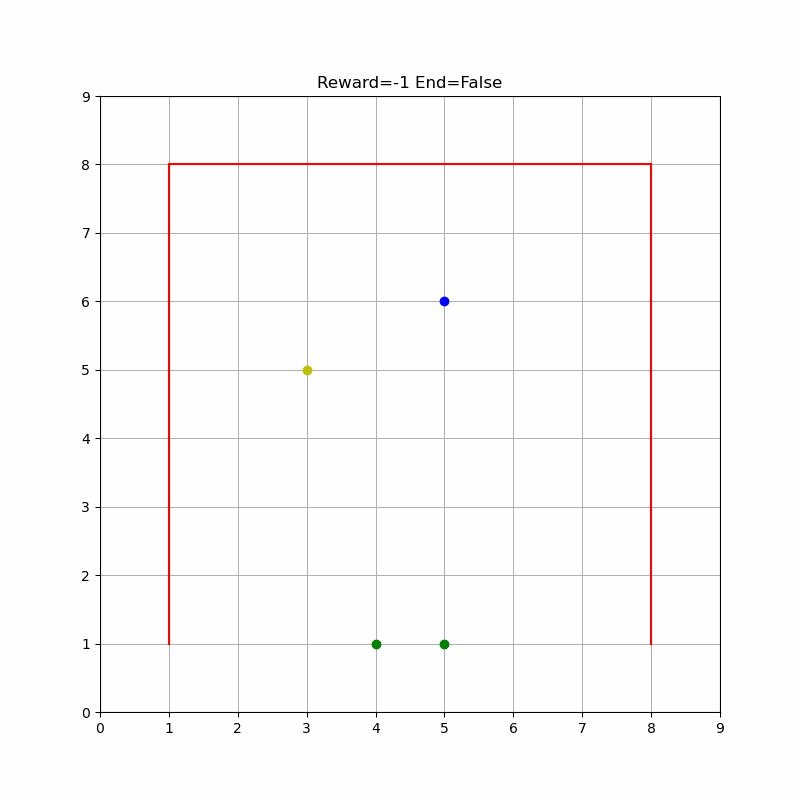
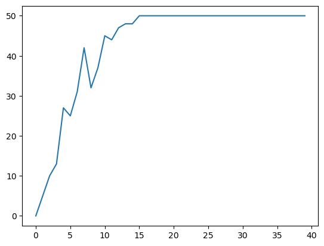

# Soccer Bot: Reinforcement Learning with Deep Q Learning

## Project Overview

This project implements a Soccer Bot using Reinforcement Learning, specifically Deep Q Learning. The bot is trained in a simulated environment and then transferred to a physical Arduino robot.



## Key Components

1. **Custom Gym Environment**: Developed in Python to train the bot.
2. **Deep Q Learning Algorithm**: Used to train the Agent in the custom environment.
3. **OpenCV Integration**: For object detection through a fixed camera.
4. **Arduino Robot**: Physical implementation of the trained agent.

## Training Results

The Agent learns through multiple episodes how to solve the environment. The training curve below shows the number of goals scored over episodes:



As demonstrated, the Agent eventually learns a policy that can consistently guide the ball to the goal in each episode.

## Physical Implementation

After training, we used OpenCV for real-time object detection via a fixed camera. This input is then provided to an Arduino robot that moves an object towards a goal.


The gif above shows the Arduino Robot scoring its first goal during the hackathon!

## Environment Setup

To set up the project environment:

```bash
# Create the environment
conda env create -f environment.yml

# Activate the environment
conda activate soccerbot_env

# Update the environment (if needed)
conda env update --file environment.yml --prune