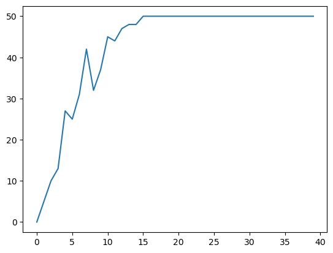

Training Curve - Number of times Agent is able to get the ball to the goal (reward) in every 50 episodes  

As we can see eventually the Agent is able to learn a Policy that is able to take the goal to the ball in each episode reliably

Here is a what the training looks like in a 2D model. 

Create Environment
conda env create -f environment.yml
conda activate soccerbot_env
conda env update --file environment.yml --prune
